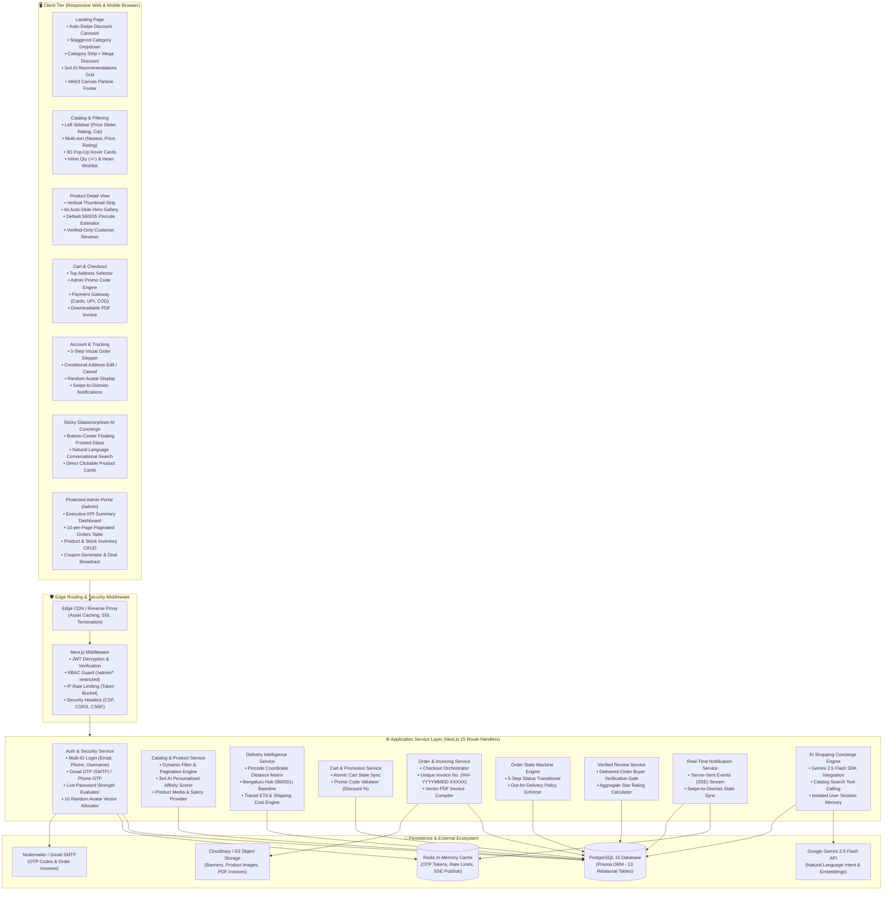
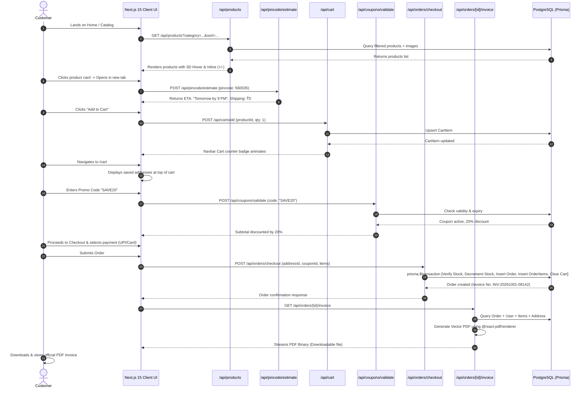
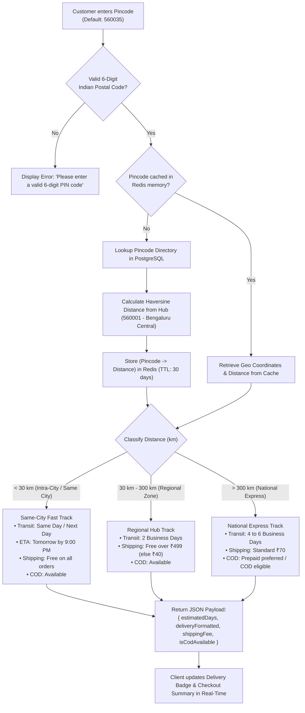
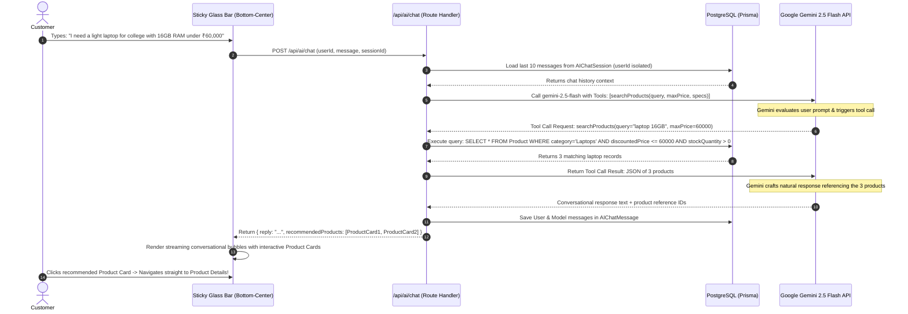
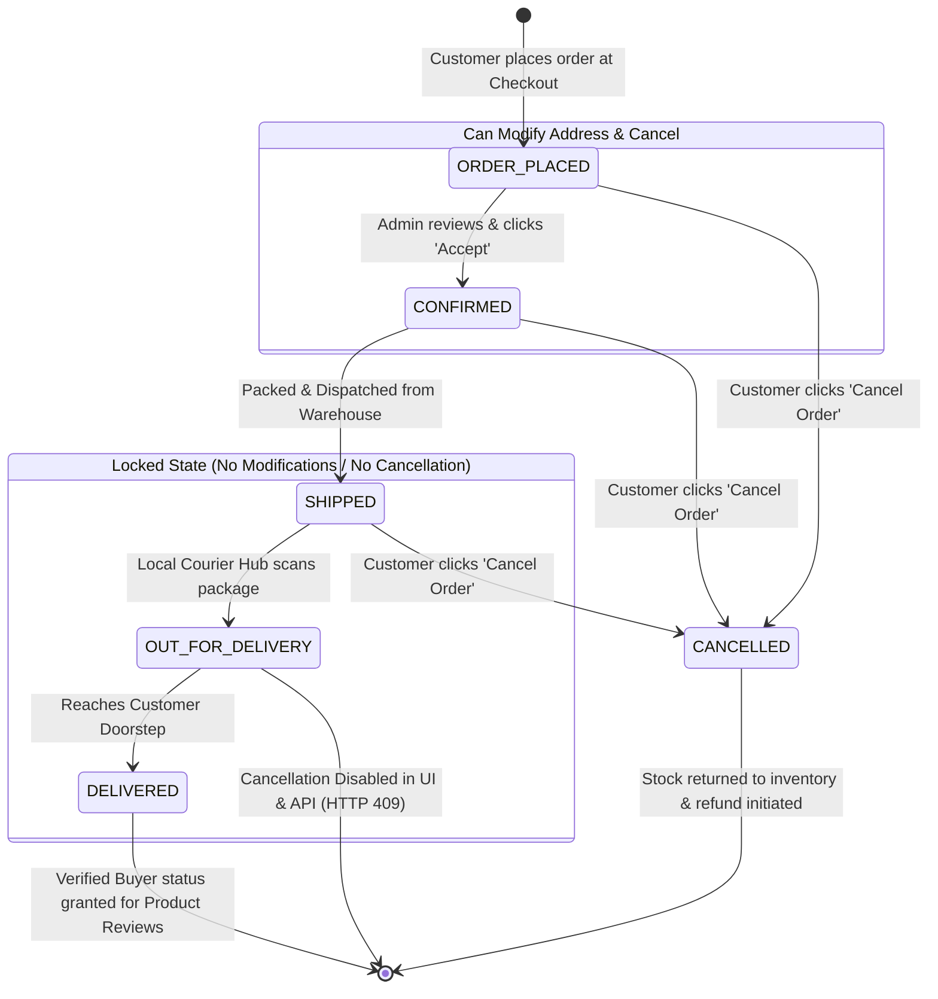
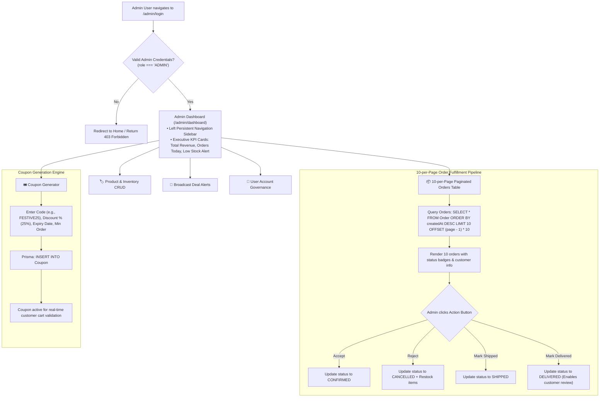
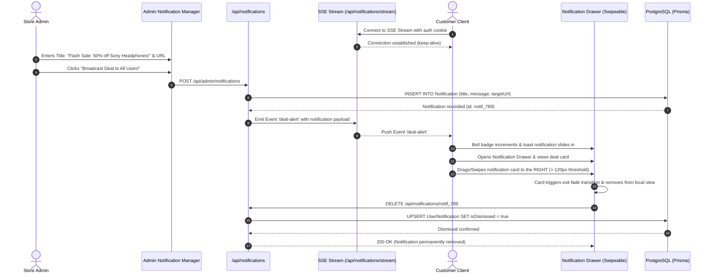
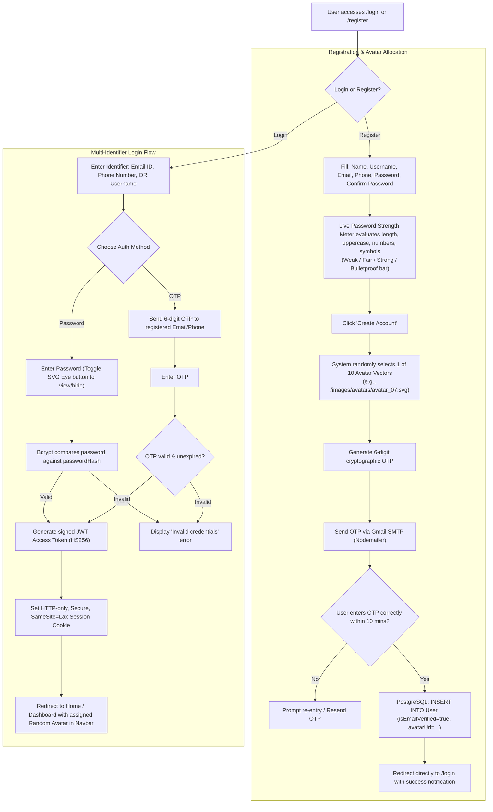
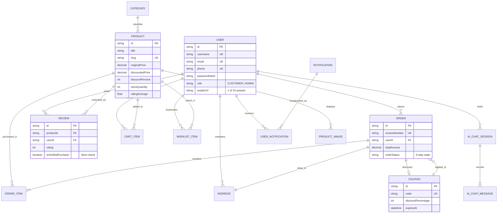
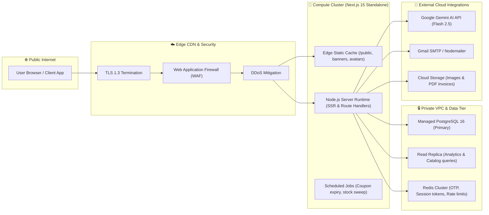

# E-Shop — Complete Technical Architecture & Flow Specifications

> **System Blueprint, Micro-Flows, State Machines & Integration Topologies**  
> *Engineered for high-throughput, low-latency e-commerce with integrated Google Gemini AI and Web3 aesthetics.*

---

### 📚 Project Architecture & Planning Suite

| Document / Asset | File Path | Focus Area |
|---|---|---|
| 📋 **Enhanced Master Planning Document** | [EShop_Project_Planning_Document.md](file:///c:/Users/WIN%2011/Desktop/E%20commerce/E_Shop/EShop_Project_Planning_Document.md) | Provenance tags `[U]`/`[R]`, Assumptions A1–A10, and 20 Phased Incremental Prompts (P1–P20). |
| 📖 **Master Project Specification** | [README.md](file:///c:/Users/WIN%2011/Desktop/E%20commerce/E_Shop/README.md) | The single authoritative full-stack blueprint covering all 16 planning sections. |
| 🖥️ **Interactive Architecture Dashboard** | [architecture-diagram.html](file:///c:/Users/WIN%2011/Desktop/E%20commerce/E_Shop/architecture-diagram.html) | Interactive visual navigator with real-time Mermaid diagrams, tabbed flows, and zoom controls. |
| 🖼️ **System Architecture Blueprint** | [architecture-diagram.jpg](file:///c:/Users/WIN%2011/Desktop/E%20commerce/E_Shop/architecture-diagram.jpg) | High-resolution infographic displaying multi-tier services, Edge gateway, and persistence layers. |

---

## Table of Contents
1. [Global System Architecture](#1-global-system-architecture)
2. [Flow Architecture 1: Customer E-Commerce Purchase & Invoicing Flow](#2-flow-architecture-1-customer-e-commerce-purchase--invoicing-flow)
3. [Flow Architecture 2: Smart Pincode Delivery Estimator Flow (Default 560035)](#3-flow-architecture-2-smart-pincode-delivery-estimator-flow-default-560035)
4. [Flow Architecture 3: Sticky Glassmorphism AI Concierge & Gemini Tool Calling Flow](#4-flow-architecture-3-sticky-glassmorphism-ai-concierge--gemini-tool-calling-flow)
5. [Flow Architecture 4: 5-Step Order State Machine & Conditional Modification Gate](#5-flow-architecture-4-5-step-order-state-machine--conditional-modification-gate)
6. [Flow Architecture 5: Admin Operations, 10-per-Page Orders & Stock Analytics Flow](#6-flow-architecture-5-admin-operations-10-per-page-orders--stock-analytics-flow)
7. [Flow Architecture 6: Broadcast Notifications & Swipe-to-Dismiss Gesture Flow](#7-flow-architecture-6-broadcast-notifications--swipe-to-dismiss-gesture-flow)
8. [Flow Architecture 7: Multi-Identifier Authentication, OTP & Random Avatar Flow](#8-flow-architecture-7-multi-identifier-authentication-otp--random-avatar-flow)
9. [Entity Relationship & Data Flow Architecture](#9-entity-relationship--data-flow-architecture)
10. [Infrastructure, Network & Security Topology](#10-infrastructure-network--security-topology)

---

## 1. Global System Architecture

The following diagram illustrates the complete end-to-end topological layout of E-Shop across the Client Tier, Edge & Middleware Tier, Application Service Layer, and Persistence / Third-Party Tier.

---

## 2. Flow Architecture 1: Customer E-Commerce Purchase & Invoicing Flow

This sequence diagrams the end-to-end purchasing lifecycle: browsing, 3D card oversight, pincode check, address selection, coupon application, payment, and instantaneous PDF invoice generation.

---

## 3. Flow Architecture 2: Smart Pincode Delivery Estimator Flow (Default 560035)

E-Shop defaults to `560035` (Bengaluru, Karnataka) and computes delivery transit times from the central logistics distribution hub located at `560001`.

---

## 4. Flow Architecture 3: Sticky Glassmorphism AI Concierge & Gemini Tool Calling Flow

The conversational shopping concierge hovers at the bottom-center with frosted glass (`backdrop-filter: blur(16px)`). It remembers individual customer context and uses Gemini function calling to pull live products.

---

## 5. Flow Architecture 4: 5-Step Order State Machine & Conditional Modification Gate

Orders follow a deterministic 5-stage lifecycle. The business rules enforce that **address modifications** and **cancellations** can occur **only prior to dispatch (`OUT_FOR_DELIVERY`)**.

### Policy Gate Table
| Current Order Status | Can Customer Modify Address? | Can Customer Cancel Order? | API Validation Rule |
|---|:---:|:---:|---|
| `ORDER_PLACED` | ✅ Yes | ✅ Yes | Status check passes; executes address update / cancellation. |
| `CONFIRMED` | ✅ Yes | ✅ Yes | Status check passes; notifies logistics queue. |
| `SHIPPED` | ✅ Yes | ✅ Yes | Allowed if manifest update sent to courier before loading. |
| `OUT_FOR_DELIVERY` | ❌ **LOCKED** | ❌ **LOCKED** | UI disables action buttons; API rejects with `409 Conflict`. |
| `DELIVERED` | ❌ **LOCKED** | ❌ **LOCKED** | Terminal status. Opens verified review submission rights. |
| `CANCELLED` | ❌ **LOCKED** | ❌ **LOCKED** | Terminal status. Re-credits inventory quantity. |

---

## 6. Flow Architecture 5: Admin Operations, 10-per-Page Orders & Stock Analytics Flow

The admin portal is strictly protected and hidden from front-end customer navigation (`/admin/*`).

---

## 7. Flow Architecture 6: Broadcast Notifications & Swipe-to-Dismiss Gesture Flow

Admin broadcasts flash deals to all active users via Server-Sent Events (SSE). Customers can view them in the notification drawer and dismiss them with an interactive right-swipe gesture.

---

## 8. Flow Architecture 7: Multi-Identifier Authentication, OTP & Random Avatar Flow

Customers can log in using either Email ID, Phone Number, or Username, authenticated either via Password (with SVG eye toggle) or OTP (Gmail SMTP / Phone). Signup assigns one of 10 distinct, vibrant random avatar vectors.

---

## 9. Entity Relationship & Data Flow Architecture

The data flow mapping connects customers, products, reviews, carts, coupons, orders, and AI chat sessions.

---

## 10. Infrastructure, Network & Security Topology

---

*This concludes the complete, official Technical Architecture Specification and Flow Diagrams for **E-Shop**.*
