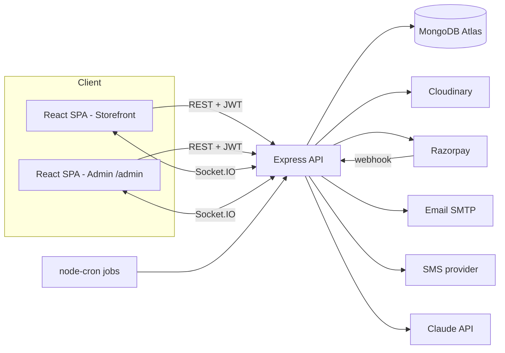
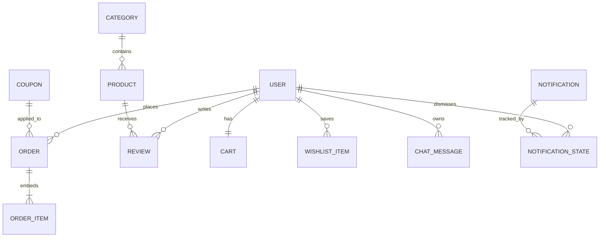

# E-Shop — Full-Stack Project Planning Document

**Legend (provenance):** **[U]** = confirmed by you in your requirements · **[R]** = my recommended default · **(Assumption: …)** = inferred/assumed, please confirm or correct.

---

## 1. Project Overview

**Product name:** E-Shop **[U]**

**Executive summary:** E-Shop is a full-stack e-commerce web application modelled on Amazon and Flipkart. Shoppers browse categorised products, search with AI, get personalised recommendations, chat with an AI shopping assistant, pay online, and track orders. A hidden admin panel manages products, orders, users, coupons, notifications, and analytics.

**Problem statement:** Small and mid-size sellers and learners building commerce platforms need a complete, modern storefront with real operational tooling (inventory, orders, coupons, invoices) and smart discovery (AI search, recommendations, chat) rather than a basic product list.

**Proposed solution:** One web app with two surfaces: a **customer storefront** (discovery, cart, checkout, account) and an **admin console** (operations and analytics), backed by a REST API, MongoDB, a payment gateway, email/SMS OTP, PDF invoicing, real-time notifications, and an LLM-powered assistant grounded in the live product catalogue.

**Business goals**
1. Deliver a complete browse → buy → deliver → review lifecycle. **[U]**
2. Differentiate with AI search, recommendations, and a per-user shopping chat. **[U]**
3. Give admins full operational control and visibility. **[U]**
4. Be deployable as a public live demo. **[U]** ("when we click on the deployed project")

**Success metrics / KPIs (Assumption: targets for a portfolio/academic-scale launch)**

| Metric | Target |
|---|---|
| End-to-end purchase (register → pay → invoice) works with no manual DB intervention | 100% of test runs |
| Landing page Largest Contentful Paint (4G, mid-range phone) | ≤ 2.5 s |
| AI search first results returned | ≤ 3 s p95 |
| Admin can complete product CRUD, order status change, coupon creation without dev help | Yes |
| Critical-flow automated test pass rate | 100% before each release |
| Cart-to-order conversion (analytics tracked) | Tracked from day 1 |

---

## 2. Target Users and Roles

### 2.1 Personas
| Persona | Description | Key needs |
|---|---|---|
| **Riya, casual shopper** | 22, mobile-first, price-sensitive | Discounts, filters, fast checkout, delivery ETA |
| **Arjun, deal hunter** | 30, compares many products | Sorting, wishlist, coupons, notifications |
| **Meera, undecided buyer** | 35, doesn't know exactly what she wants | AI chat to plan purchases from a need |
| **Admin / store owner** | Runs catalogue and fulfilment | CRUD, order handling, coupons, analytics |

### 2.2 Roles and permissions
| Capability | Guest | Customer | Admin |
|---|---|---|---|
| Browse home, categories, product pages | ✅ | ✅ | ✅ |
| AI search | ✅ | ✅ | ✅ |
| Wishlist, cart | ❌ (prompt login) | ✅ | — |
| Checkout, orders, reviews (verified buyers), notifications, AI chat, recommendations | ❌ | ✅ | — |
| Product/order/user/coupon/notification/banner management, analytics | ❌ | ❌ | ✅ |

**Admin is not exposed in the storefront UI [U]:** no admin links or signup. Admin accounts are created by a seed script at build/deploy time. The admin console lives at a separate unlisted route (`/admin`) and is protected by role checks on every API call.

### 2.3 Primary user journeys
1. **Discover → Buy:** Landing poster → product → add to cart → address → coupon → pay → invoice.
2. **Guided buy:** Open AI chat → describe need and budget → pick suggested product → checkout.
3. **Post-purchase:** My Orders → Track → change address / cancel (before dispatch) → delivered → review.
4. **Admin daily:** Dashboard → new orders → accept → mark delivered → create coupon → broadcast deal notification.

---

## 3. Scope Definition

### 3.1 MVP (all features you listed are in scope; "MVP" = first full release)
Everything in Section 4 is in the first release, built in the phase order of Section 11. If time is short, the **cut line** (build last, drop first) is: Web3 animation, chat history search, one-click export formats beyond CSV, and phone-OTP via SMS (fall back to email OTP only).

### 3.2 Post-MVP **[R]**
Multi-vendor sellers, returns/refunds workflow, product variants (size/colour) with per-variant stock, saved payment methods, PWA/offline, push notifications, multi-language, recommendation model upgrade (collaborative filtering), product Q&A.

### 3.3 Out of scope
Native mobile apps, multi-currency, international shipping, real courier API integration, marketplace seller onboarding, live human chat support, blockchain/crypto payments (see Assumption A1).

### 3.4 Assumptions and constraints
| # | Assumption |
|---|---|
| A1 | **"Web 3 animation"** means a modern *Web3-style visual* (animated gradient mesh / particle / 3D-network background on the About/footer section), **not** blockchain functionality. |
| A2 | Currency is INR (₹); language English; timezone IST. |
| A3 | Delivery distance is computed from a **warehouse PIN code** (default env value `560001`, adjustable) to the customer PIN, using PIN-code centroid coordinates and the Haversine formula. |
| A4 | Payment uses **Razorpay in test mode** (India-native; supports UPI/cards/netbanking). |
| A5 | Phone OTP uses an SMS provider (MSG91 or Twilio); in dev, OTPs are logged to the server console. |
| A6 | Solo developer / student-scale team, free/low-cost hosting tiers. |
| A7 | Your note "**refer image**" (category boxes) refers to a reference image I don't have; I design category boxes as image cards. Send the image if you want an exact match. |
| A8 | Two unclear phrases in your notes are interpreted as: "when the user [unclear] or add the cart" → *adds or removes items*; "[unclear] of ordering" → *before the order is dispatched*. |
| A9 | "Draw/register new" → *"New user? Register"* link on login. |
| A10 | Admin "complete payment will be created" → a **payment/settlement summary report** exported with the order list. |

---

## 4. Functional Requirements

Format: user story → acceptance criteria (AC). Edge cases/validation listed per module.

### 4.1 Landing page & navigation **[U]**
- **FR-1:** *As a visitor, I want auto-swiping discount posters, so that I notice current deals.* AC: carousel auto-advances left→right (default 4 s), pauses on hover/touch, has dots + arrows; clicking a poster opens its linked product (or category/deal URL); posters managed by admin.
- **FR-2:** *As a shopper, I want a category dropdown in the top bar, so that I can jump to a category.* AC: dropdown opens with an animated slide/fade (≤ 250 ms), keyboard accessible, closes on outside click/Esc.
- **FR-3:** Top bar layout: logo (top-left, links to home) · centred AI search with search button · right side: wishlist heart, cart icon with live count badge, Login button (shown when logged out; replaced by avatar menu when logged in). **[U]**
- **FR-4:** Below posters: category boxes (image + name) with a prominent "Discount" button/filter shortcut. **[U]**
- **FR-5:** "Recommended for you" grid of 12 products (3 × 4 desktop; 2-col mobile). AC: logged-in users get personalised results; guests get trending/top-discount fallback.
- **FR-6:** Footer/About section: about the project, "Contact developers", Web3-style animation (A1).

### 4.2 Authentication **[U]**
- **FR-7 Register:** fields Name, Username, Email, Phone, Password, Confirm Password. Verification via **either** email OTP **or** phone OTP (user's choice). On success, redirect to Login.
  - Validation: name 2–60 chars; username 3–20 `[a-z0-9_]`, unique; email RFC-valid, unique; phone 10-digit Indian mobile (`^[6-9]\d{9}$`), unique; password ≥ 8 chars with upper, lower, digit, symbol; confirm must match.
  - Live **password strength meter** (weak/fair/good/strong) and show/hide eye toggle.
  - Edge: duplicate identifiers → field-level error; OTP expiry 10 min, max 5 attempts, resend cooldown 30 s.
- **FR-8 Login:** identifier may be **phone, username, or email**; then verify by **password** *or* **OTP** (to email). Eye toggle on password. AC: generic error "Invalid credentials" (no user enumeration); lockout after 5 failures/15 min per account+IP.
- **FR-9 Forgot password:** request OTP to email/phone → verify → set new password (strength rules apply). AC: all refresh sessions revoked after reset.
- **FR-10 Random avatar:** on first login, assign a random avatar icon from a preset set (≥ 12) and persist it. User can change it in Profile.

### 4.3 Product browsing
- **FR-11 Listing page with left filter sidebar:** category, **price range (min–max)**, brand, rating (4★+), availability (in stock), discount % (10/25/50+), and delivery speed *(extra e-commerce filters, [R])*.
- **FR-12 Sorting [U]:** recently added, last added (oldest first), price low→high, price high→low; plus relevance, rating, discount % *[R]*.
- **FR-13 Product card [U]:** image, name, short info, price, discounted price, discount %, add to cart with +/− quantity stepper, wishlist heart on the image; hover lifts/scales card slightly.
- **FR-14 Product detail page [U]:** opens in a **new tab**; left vertical thumbnail strip; main image auto-slides every 6 s with left/right arrows (pauses on hover); description, specs, price block, stock status, delivery estimate, Add to Cart / Buy Now, reviews.
  - Edge: out-of-stock disables buttons; quantity capped at stock and at 10 per order *(Assumption)*.
- **FR-15 Delivery estimate [U]:** PIN defaults to **560035**; user may enter any 6-digit PIN. AC: server returns distance (km) and ETA date range; invalid/unknown PIN → clear error; saved to profile if logged in.
- **FR-16 Reviews [U]:** only **verified buyers (order delivered containing the product)** can review; 1–5 stars + text (≤ 1000 chars); one review per user per product; **real-time** appearance for others viewing the page (WebSocket).

### 4.4 AI features **[U]**
- **FR-17 AI smart search:** natural-language query ("budget phone under 15000 with good camera") → ranked products from the live catalogue. AC: results only include real product IDs; fallback to keyword search if AI is unavailable.
- **FR-18 AI recommendations:** 12 items per user based on views, wishlist, purchases, and category affinity.
- **FR-19 AI personalised chat:** each account has its **own** conversation history/context. AI suggests catalogue products as clickable cards linking to the product page. Persistent left sidebar for logged-in users (navigation: Home, Chat, Orders, Wishlist, Profile).
- **FR-20 Floating glass AI search bar:** fixed bottom-centre, stays visible while scrolling, glassmorphism styling (backdrop blur, translucent border), expands to open chat.

### 4.5 Wishlist, cart, checkout
- **FR-21 Wishlist:** heart toggles on cards/PDP; wishlist page; count badge optional.
- **FR-22 Cart:** add/remove/update quantity; **top-bar badge updates live** **[U]**; persists server-side for logged-in users (guest cart in localStorage merges at login).
- **FR-23 Checkout:** select/add delivery address at top of the cart/checkout page **[U]**; products list; **promo code** box (admin-created codes only) **[U]**; price summary (subtotal, discount, delivery fee *(Assumption: free above ₹499, else ₹40)*, total); pay via payment gateway.
  - Edge: price/stock re-validated server-side at order creation; coupon re-validated (active, not expired, min order, usage limit, per-user limit).
- **FR-24 Invoice [U]:** after successful payment, order is placed, unique invoice number generated (`ESH-YYYY-000001`), PDF generated, and a Download Invoice button is available in order details and confirmation page.

### 4.6 Account & orders **[U]**
- **FR-25** Account menu: Profile, My Orders, Track Order, Logout, Delete Account.
- **FR-26 Profile:** edit name, username, phone, email (re-verification via OTP), avatar, addresses (add/edit/delete/default).
- **FR-27 My Orders / Track Order:** list with status timeline (Placed → Accepted → Packed → Shipped → Out for delivery → Delivered; or Rejected/Cancelled).
- **FR-28:** **Change address** and **Cancel order** allowed only before status reaches *Shipped* (Assumption for "before out for delivery"; configurable). Cancel restocks inventory and triggers refund (test-mode).
- **FR-29 Delete account:** requires password/OTP re-auth; anonymises personal data but retains order/invoice records required for accounting.

### 4.7 Notifications **[U]**
- **FR-30:** Admin publishes a "latest deal" notification; **all users** receive it (bell icon with unread count; real-time via WebSocket, fetched on login for offline users).
- **FR-31:** User dismisses a notification by **swiping right** (touch + mouse drag; keyboard-accessible delete button as alternative). Dismissal is per-user and does not affect others.

### 4.8 Admin console **[U]**
- **FR-32 Navigation:** persistent left sidebar with all sections: Dashboard, Products, Categories, Orders, Users, Coupons, Notifications, Banners/Posters, Analytics, Reports.
- **FR-33 Dashboard:** summary of orders (today/7d/30d), revenue, pending orders, low-stock alerts, top products, recent activity.
- **FR-34 Product CRUD:** create/read/update/delete (soft delete) with multi-image upload, price, discount %, stock, category, brand, description, specs, active flag; bulk edit of list *("Edit product list")*.
- **FR-35 Orders:** table with **10 per page** and pagination; filter by status/date/payment; actions **Accept, Reject (with reason), Mark Delivered**; full detail view (items, customer, address, payment, coupon, invoice, timeline).
- **FR-36 Users:** list with login/account details (last login, status, order count); **delete user** (with confirmation; same anonymise rule as FR-29).
- **FR-37 Coupons:** create with code (auto-generated or custom), **discount percent**, optional max-discount cap, min order value, expiry, usage limits, active toggle.
- **FR-38 Analytics:** stock levels, sales over time, category share, top products, user signups/activity.
- **FR-39 One-click export:** generate complete order list + payment summary (CSV and PDF) for a chosen date range.
- **FR-40 Notifications & banners:** compose and send deal notification; manage poster slides (image, link, order, active dates).

---

## 5. Non-Functional Requirements

| Area | Requirement |
|---|---|
| Performance | API p95 ≤ 500 ms (excluding AI/payment calls); LCP ≤ 2.5 s; images lazy-loaded, WebP/AVIF via CDN transforms; route-level code splitting; product lists paginated (24/page) |
| Scalability (A6) | Designed for ~1,000 concurrent users on a single backend instance; stateless API (horizontally scalable); DB indexes per Section 8 |
| Availability | 99% best-effort on free tiers; health-check endpoint `/api/health`; graceful degradation when AI/SMS is down |
| Accessibility | WCAG 2.1 AA: semantic HTML, keyboard navigation for dropdowns/carousels/swipe actions, visible focus, alt text, colour contrast ≥ 4.5:1, `prefers-reduced-motion` disables auto-slide/animations |
| Browser/device | Last 2 versions of Chrome, Edge, Safari, Firefox; Android Chrome and iOS Safari; breakpoints 360 / 768 / 1024 / 1280 |
| Localization | English only; INR; IST; `Intl` formatting so i18n can be added later |
| Observability | Structured JSON logs, request IDs, error tracking (Sentry free tier) |
| Data | PII encrypted in transit (TLS); passwords hashed (bcrypt cost 12) |

---

## 6. UX/UI Requirements

### 6.1 Information architecture / sitemap
```
/                         Home (posters, categories, recommended, about)
/category/:slug           Product listing (filters + sort)
/search?q=                AI search results
/product/:slug            Product detail (opens in new tab)
/wishlist
/cart
/checkout
/order/success/:orderId
/login  /register  /forgot-password
/account/profile
/account/orders           My Orders
/account/orders/:id       Order detail / Track Order
/chat                     AI shopping assistant
/notifications            (also bell dropdown)
/admin/*                  Dashboard, products, orders, users, coupons, notifications, banners, analytics
```

### 6.2 Screen inventory
Home · Listing · Search results · Product detail · Wishlist · Cart · Checkout · Order success · Login · Register · Forgot password · OTP modal · Profile · My Orders · Order detail/tracking · AI Chat · Notifications panel · 404 · Admin: Login, Dashboard, Products (list/form), Orders (list/detail), Users, Coupons, Notifications, Banners, Analytics.

### 6.3 Key flows
Guest → add to cart → login prompt → merge cart → checkout → pay → success + invoice. AI chat → suggestion card → product page → add to cart.

### 6.4 Responsive rules
Mobile: hamburger for categories, search collapses to icon + bottom floating glass bar remains; filters in a slide-up drawer; sidebar becomes bottom tab/drawer. Tablet: 2–3 column grids. Desktop: full top bar, left filter sidebar, left user sidebar.

### 6.5 Design-system guidance **[R]**
- **Tokens (Assumption: you didn't give a palette):** primary indigo `#4F46E5`, accent amber `#F59E0B` (discounts), success `#16A34A`, danger `#DC2626`, neutral slate scale; light theme default, dark mode optional. Font: Inter (body), Poppins (headings). Spacing 4-pt scale; radius 12 px cards.
- **Components:** Button (primary/secondary/ghost/icon), Input (with eye toggle, error text), OTP input, Card (hover lift: `translateY(-4px) scale(1.02)`), Badge, Dropdown/Mega-menu, Carousel, Modal/Drawer, Toast, Skeleton, Pagination, Table, Stepper (order timeline), SwipeToDismiss, GlassBar.
- **Glass style:** `background: rgba(255,255,255,0.15); backdrop-filter: blur(16px); border: 1px solid rgba(255,255,255,0.3)` with a solid fallback when blur is unsupported.
- **States:** every data view needs loading (skeleton), empty (illustration + CTA), error (retry), and success (toast) states.
- **Motion:** 150–250 ms ease-out for UI; carousel 4 s (posters) / 6 s (PDP, **[U]**); honour reduced motion.


---

## 7. Technical Architecture

### 7.1 Recommended stack **[R]** (you did not specify one)
| Layer | Choice | Rationale |
|---|---|---|
| Frontend | React 18 + Vite, React Router, Tailwind CSS, Framer Motion, Zustand (or Redux Toolkit), TanStack Query, Three.js/tsparticles (Web3 visual) | Fast dev, rich animation, strong ecosystem |
| Backend | Node.js 20 + Express, Zod validation | Same language end-to-end, simple for a solo dev |
| Database | MongoDB Atlas + Mongoose | Flexible product attributes, easy hosting; text/compound indexes |
| Real-time | Socket.IO | Live reviews, notifications, order status |
| Auth | JWT access token (15 min) + rotating refresh token in httpOnly cookie; bcrypt | Stateless API, secure session handling |
| OTP | Nodemailer (Gmail SMTP for dev / Brevo or Resend for prod) + MSG91/Twilio SMS (A5) | Email + phone OTP |
| Payments | Razorpay (test mode) with webhook verification | UPI/cards, India-friendly |
| Files | Cloudinary (images), PDFKit (invoices, stored in Cloudinary or generated on demand) | Free tier, transforms |
| AI | Anthropic Claude API (model name via env `LLM_MODEL`) called **server-side only** | Search, chat, recommendations |
| Jobs | node-cron (OTP/cart cleanup, low-stock alerts); upgrade to BullMQ + Redis if needed | Lightweight |
| Hosting | Vercel (frontend), Render/Railway (backend), MongoDB Atlas (DB) | Free tiers |

(If you prefer another stack, e.g. Next.js, tell me and sections 7, 11, 16 adapt; the requirements do not change.)

### 7.2 Frontend architecture
Feature-based folders; server state via TanStack Query; UI state (cart badge, auth, theme) via Zustand; axios instance with interceptor for silent token refresh; lazy-loaded routes (admin bundle separate); Socket.IO client provider.

### 7.3 Backend architecture
Layered: `routes → controllers → services → models`. Middleware: `requestId`, `helmet`, `cors`, `rateLimit`, `auth`, `requireRole`, `validate(zod)`, `errorHandler`. Admin routes mounted under `/api/admin` behind `requireRole('admin')`.

### 7.4 AI design (grounded, anti-hallucination)
1. **Search:** backend runs keyword/text search + filters to fetch ≤ 30 candidate products → sends query + compact candidate list to the LLM → LLM returns ordered product IDs + short reason (JSON) → backend **drops any ID not in the candidate list** → returns full product objects.
2. **Chat:** system prompt contains store rules; per-user message history (last N turns) loaded by `userId`; the LLM may call a `search_products` tool (backend function) and returns text + product IDs; frontend renders cards from IDs. Chats are isolated by `userId` at the query level. **[U]** (individual context per account)
3. **Recommendations:** score = category affinity from views/wishlist/purchases + popularity + discount; AI re-rank optional; cached 1 h per user.
4. Rate limit AI endpoints (e.g. 20 req/min/user) and cap tokens to control cost.

### 7.5 Delivery estimate
`pincodes` collection (pincode, lat, lng, district, state) seeded from a public India PIN dataset (Assumption: data source to be chosen; do not hand-type). Distance = Haversine(warehouse, destination). ETA = base 1 day + ceil(distance / 400 km per day) *(Assumption; configurable)*.

### 7.6 Architecture diagram


---

## 8. Database Design

### 8.1 Entities and relationships


### 8.2 Collections (MongoDB / Mongoose)
| Collection | Key fields (type) | Indexes / constraints |
|---|---|---|
| **users** | name, username (unique, lowercase), email (unique), phone (unique), passwordHash, role (`customer`\|`admin`), avatar (string), addresses[ {label, name, phone, line1, line2, city, state, pincode, isDefault} ], defaultPincode (default `560035`), emailVerified, phoneVerified, status (`active`\|`deleted`), lastLoginAt, createdAt | unique: email, username, phone |
| **otps** | target (email/phone), purpose (`register`\|`login`\|`reset`\|`email_change`), codeHash, attempts, expiresAt, consumedAt | TTL on `expiresAt`; index (target, purpose) |
| **refreshtokens** | userId, tokenHash, expiresAt, revokedAt, userAgent | TTL; index userId |
| **categories** | name, slug (unique), image, parentId?, order, active | unique slug |
| **products** | name, slug (unique), description, shortInfo, specs (map), brand, categoryId, images[ {url, alt} ], mrp, discountPercent, price (computed: mrp − discount), stock, ratingAvg, ratingCount, tags[], active, deletedAt, createdAt | text index (name, brand, tags, description); compound (categoryId, price), (active, createdAt); check price ≥ 0, discount 0–90 |
| **banners** | image, linkType, linkTarget, order, startsAt, endsAt, active | index (active, order) |
| **carts** | userId (unique), items[ {productId, qty} ], updatedAt | unique userId |
| **wishlists** | userId, productId, createdAt | unique (userId, productId) |
| **orders** | orderNo, invoiceNo (unique), userId, items[ {productId, name, image, price, mrp, qty} ] (snapshot), shippingAddress (snapshot), pricing {subtotal, discount, delivery, total}, couponCode, payment {provider, razorpayOrderId, paymentId, status, method}, status, timeline[ {status, at, by, note} ], estimatedDelivery, invoiceUrl, createdAt | unique invoiceNo; index (userId, createdAt), (status, createdAt) |
| **coupons** | code (unique, uppercase), percent (1–90), maxDiscount?, minOrder, startsAt, expiresAt, usageLimit, usedCount, perUserLimit, active, createdBy | unique code |
| **reviews** | productId, userId, orderId, rating (1–5), text, createdAt | unique (productId, userId); index productId |
| **notifications** | title, body, type (`deal`\|`order`\|`system`), link, audience (`all`\|userId), createdBy, createdAt | index (audience, createdAt) |
| **notificationstates** | userId, notificationId, readAt, dismissedAt | unique (userId, notificationId) |
| **chatmessages** | userId, sessionId, role (`user`\|`assistant`), content, productIds[], createdAt | index (userId, sessionId, createdAt) |
| **activitylogs** | userId?, action, entity, entityId, meta, ip, createdAt | index (createdAt); used by analytics and audit |
| **pincodes** | pincode (unique), lat, lng, district, state | unique pincode |
| **counters** | _id (e.g. `invoice-2026`), seq | atomic `$inc` for invoice numbers |

**Order status enum:** `pending_payment → placed → accepted → packed → shipped → out_for_delivery → delivered`; terminal alternates: `rejected`, `cancelled`, `payment_failed`.

### 8.3 Illustrative snippet
```js
// product.model.js (illustrative)
const productSchema = new Schema({
  name: { type: String, required: true, trim: true, maxlength: 160 },
  slug: { type: String, unique: true, index: true },
  mrp: { type: Number, required: true, min: 0 },
  discountPercent: { type: Number, default: 0, min: 0, max: 90 },
  stock: { type: Number, default: 0, min: 0 },
  categoryId: { type: Schema.Types.ObjectId, ref: 'Category', index: true },
  active: { type: Boolean, default: true },
}, { timestamps: true });
productSchema.index({ name: 'text', brand: 'text', tags: 'text', description: 'text' });
```

### 8.4 Retention and deletion
- User deletion: set `status=deleted`; remove name/email/phone/addresses/avatar (replace with anonymised placeholders); delete wishlist, cart, chat history, notification states; **retain orders and invoices** (financial records) with anonymised customer reference.
- OTPs and refresh tokens expire via TTL. Chat history retained until account deletion (user may clear chats). Activity logs retained 12 months *(Assumption)*.

---

## 9. API Specification

Base URL `/api/v1`. JSON responses: `{ "success": true, "data": … }` or `{ "success": false, "error": { "code", "message", "fields?" } }`. Auth: `Bearer <accessToken>`; refresh via httpOnly cookie. Common errors: 400 validation, 401 unauthenticated, 403 forbidden, 404, 409 conflict, 429 rate-limited, 500.

### 9.1 Auth
| Method | Path | Purpose | Auth | Body | Notes |
|---|---|---|---|---|---|
| POST | /auth/register/request-otp | Validate details, send OTP | – | name, username, email, phone, password, confirmPassword, channel (`email`\|`phone`) | 409 if duplicate |
| POST | /auth/register/verify | Verify OTP, create user | – | email/phone, otp | returns 201; client redirects to login |
| POST | /auth/login | Password login | – | identifier (email/phone/username), password | returns access token + user |
| POST | /auth/login/request-otp | OTP login | – | identifier | generic response always |
| POST | /auth/login/verify-otp | Complete OTP login | – | identifier, otp | |
| POST | /auth/refresh | Rotate refresh token | cookie | – | |
| POST | /auth/logout | Revoke refresh token | user | – | |
| POST | /auth/forgot-password | Send reset OTP | – | identifier | generic response |
| POST | /auth/reset-password | Set new password | – | identifier, otp, newPassword | revokes sessions |
| GET | /auth/me | Current user | user | – | |

Example:
```json
POST /api/v1/auth/login
{ "identifier": "riya_22", "password": "S3cure#Pass" }

200 { "success": true, "data": { "accessToken": "…", "user": { "id": "…", "name": "Riya", "avatar": "avatar-07", "role": "customer" } } }
401 { "success": false, "error": { "code": "INVALID_CREDENTIALS", "message": "Invalid credentials" } }
```

### 9.2 Catalogue
| Method | Path | Purpose | Auth | Params |
|---|---|---|---|---|
| GET | /home | Posters, categories, recommended (12) | optional | – |
| GET | /categories | All categories | – | – |
| GET | /products | List with filters | – | category, minPrice, maxPrice, brand, rating, inStock, minDiscount, sort (`newest`\|`oldest`\|`price_asc`\|`price_desc`\|`rating`\|`discount`), page, limit |
| GET | /products/:slug | Detail | – | – |
| GET | /products/:id/delivery | Distance + ETA | – | pincode (default 560035) |
| GET | /products/:id/reviews | Reviews | – | page |
| POST | /products/:id/reviews | Add review (verified buyers only; 403 otherwise) | user | rating, text |
| POST | /search/ai | AI search | optional | query |
| GET | /recommendations | 12 personalised products | optional | – |

### 9.3 Cart, wishlist, checkout, orders
| Method | Path | Purpose | Auth | Body |
|---|---|---|---|---|
| GET/PUT | /cart | Get / replace cart | user | items[{productId, qty}] |
| POST | /cart/items | Add item | user | productId, qty |
| PATCH | /cart/items/:productId | Set quantity (0 removes) | user | qty |
| DELETE | /cart/items/:productId | Remove | user | – |
| POST | /cart/merge | Merge guest cart | user | items[] |
| GET/POST/DELETE | /wishlist, /wishlist/:productId | Manage wishlist | user | – |
| POST | /coupons/validate | Check code against cart | user | code |
| POST | /orders/checkout | Create order + Razorpay order | user | addressId, couponCode? → `{orderId, razorpayOrderId, amount}` |
| POST | /orders/verify-payment | Verify signature, mark placed, generate invoice | user | razorpay_order_id, razorpay_payment_id, razorpay_signature |
| POST | /payments/webhook | Razorpay webhook (signature-verified) | public | raw body |
| GET | /orders | My orders | user | page |
| GET | /orders/:id | Order detail/tracking | user (owner) | – |
| PATCH | /orders/:id/address | Change address (before shipped) | user | addressId or address object |
| POST | /orders/:id/cancel | Cancel (before shipped) | user | reason |
| GET | /orders/:id/invoice | Download invoice PDF | user (owner) | – |

### 9.4 Account, notifications, chat
| Method | Path | Purpose | Auth |
|---|---|---|---|
| GET/PATCH | /account/profile | View/edit profile | user |
| POST/PATCH/DELETE | /account/addresses(/:id) | Manage addresses | user |
| POST | /account/delete | Delete account (password/OTP re-auth) | user |
| GET | /notifications | List (excluding dismissed) | user |
| POST | /notifications/:id/read | Mark read | user |
| DELETE | /notifications/:id | Dismiss (swipe) | user |
| GET | /chat/sessions | List sessions | user |
| POST | /chat/messages | Send message → `{reply, products[]}` | user |
| DELETE | /chat/sessions/:id | Clear chat | user |

### 9.5 Admin (all require role `admin`)
| Method | Path | Purpose |
|---|---|---|
| GET | /admin/dashboard | Summary stats |
| GET | /admin/analytics?range= | Sales, stock, activity |
| CRUD | /admin/products, /admin/categories, /admin/banners | Catalogue management; image upload via `POST /admin/uploads` |
| GET | /admin/orders?status&page&limit=10 | Paginated orders (fixed 10/page) |
| GET | /admin/orders/:id | Full detail |
| PATCH | /admin/orders/:id/status | `accept` \| `reject`(reason) \| `pack` \| `ship` \| `out_for_delivery` \| `deliver` |
| GET | /admin/orders/export?from&to&format=csv\|pdf | One-click order + payment report |
| GET | /admin/users, GET /admin/users/:id | List/detail incl. last login |
| DELETE | /admin/users/:id | Delete (anonymise) |
| CRUD | /admin/coupons | Create with `percent`, optional custom code |
| POST | /admin/coupons/generate | Auto-generate unique code |
| POST | /admin/notifications | Broadcast deal → emits socket event `notification:new` |

### 9.6 Real-time events (Socket.IO)
`review:new` (room `product:{id}`) · `notification:new` (room `user:{id}` / broadcast) · `order:status` (room `user:{id}`).

### 9.7 Auth approach
Access JWT (15 min) in memory; refresh token (7 days, rotating, hashed in DB) in httpOnly, Secure, SameSite=Lax cookie. Admin role checked server-side on every `/admin` call. Webhook: Razorpay HMAC signature verified with the raw body.

---

## 10. Security and Privacy

| Area | Requirement |
|---|---|
| Authentication | bcrypt (cost 12); OTP 6-digit, hashed, 10 min expiry, 5 attempts, 30 s resend cooldown; login rate limit 5/15 min/account + IP; generic auth errors |
| Authorization/RBAC | `requireRole`; ownership checks on orders/chat/addresses (`doc.userId === req.user.id`) to prevent IDOR; chat queries always filter by `userId` |
| Input validation | Zod schemas on every route; reject unknown fields; sanitise text (`xss`-clean/DOMPurify for reviews/chat render); `express-mongo-sanitize` against NoSQL injection |
| Web vulnerabilities | Helmet headers + CSP; strict CORS allow-list; CSRF protection for refresh cookie (SameSite + custom header check); file upload type/size limits (images ≤ 5 MB); no stack traces in prod |
| Payments | Never trust client price: recompute totals server-side; verify Razorpay signature and webhook; idempotent order finalisation |
| Pricing integrity | Stock decrement via atomic `findOneAndUpdate({stock: {$gte: qty}})` to prevent overselling |
| Secrets | `.env` only, never committed; `.env.example` committed; separate keys per environment; LLM key server-side only |
| AI safety | Prompt-injection hardening (treat user text and product text as data); only catalogue IDs returned; output length caps; per-user rate limits |
| Encryption | HTTPS/TLS everywhere; MongoDB Atlas encryption at rest; no card data stored (handled by Razorpay) |
| Audit logging | Log admin actions (product/price edits, order status, coupon creation, user deletion) with actor, IP, timestamp |
| Privacy | Consent text on register; privacy policy page; account deletion per §8.4; minimise PII in logs. Compliance: **India DPDP Act 2023** considerations (consent, deletion on request) *(Assumption: Indian users)*; **PCI-DSS** scope reduced by using Razorpay-hosted checkout; GDPR/HIPAA not applicable by default |
| Admin hardening | Admin created only via seed script; optional IP allow-list/2FA post-MVP; admin route not linked in UI |

### `.env` template
```dotenv
# Server
NODE_ENV=development
PORT=5000
CLIENT_URL=http://localhost:5173
MONGODB_URI=mongodb://localhost:27017/eshop
# Auth
JWT_ACCESS_SECRET=change_me
JWT_REFRESH_SECRET=change_me_too
ACCESS_TOKEN_TTL=15m
REFRESH_TOKEN_TTL_DAYS=7
# Admin seed (used only by seed script)
ADMIN_EMAIL=admin@example.com
ADMIN_PASSWORD=change_me
# Email OTP
SMTP_HOST=smtp.gmail.com
SMTP_PORT=587
SMTP_USER=
SMTP_PASS=
MAIL_FROM="E-Shop <no-reply@example.com>"
# SMS OTP
SMS_PROVIDER=msg91
SMS_API_KEY=
# Payments
RAZORPAY_KEY_ID=
RAZORPAY_KEY_SECRET=
RAZORPAY_WEBHOOK_SECRET=
# Media
CLOUDINARY_URL=
# AI
ANTHROPIC_API_KEY=
LLM_MODEL=
# Delivery
WAREHOUSE_PINCODE=560001
DEFAULT_USER_PINCODE=560035
FREE_DELIVERY_ABOVE=499
DELIVERY_FEE=40

---

## 11. Development Plan

### 11.1 Repo / folder structure (monorepo, **[R]**)
```
eshop/
├─ client/                      # React + Vite storefront and /admin
│  └─ src/
│     ├─ app/                   # router, providers, layout (TopBar, UserSidebar, GlassSearchBar)
│     ├─ features/
│     │  ├─ auth/  home/  catalog/  product/  cart/  checkout/
│     │  ├─ orders/  account/  notifications/  chat/  wishlist/
│     │  └─ admin/ (dashboard, products, orders, users, coupons, notifications, banners, analytics)
│     ├─ components/ui/         # design-system primitives
│     ├─ lib/ (api.js, socket.js, format.js)
│     ├─ store/                 # zustand slices
│     └─ styles/                # tokens, tailwind config
├─ server/
│  └─ src/
│     ├─ config/ (env.js, db.js)
│     ├─ models/  routes/  controllers/  services/ (ai, otp, payment, invoice, delivery, coupon)
│     ├─ middleware/  sockets/  jobs/  utils/  validators/
│     └─ scripts/ (seed-admin.js, seed-products.js, seed-pincodes.js)
├─ docs/                        # README, API docs, ADRs
├─ .github/workflows/ci.yml
└─ README.md
```

### 11.2 Dev setup
Node 20 LTS, pnpm/npm workspaces, local MongoDB or Atlas free cluster, `.env` from `.env.example`, `npm run dev` runs client and server concurrently, `npm run seed` loads admin, categories, 40+ sample products, and pincodes.

### 11.3 Conventions
ESLint + Prettier, conventional commits (`feat:`, `fix:`), camelCase JS / kebab-case files, one feature per folder, no business logic in controllers, all money in **paise (integers)** internally (display ₹).

### 11.4 Git strategy (solo/small team, A6)
`main` (deployable) + short-lived `feat/*` branches; PR per feature even when solo (CI must pass); squash merge; tag releases `v0.x`.

### 11.5 Phases and milestones
| Phase | Scope | Exit criteria |
|---|---|---|
| 0 Foundation | Repo, env, DB connect, CI, design tokens, layout shell | App boots; lint/test pipeline green |
| 1 Auth | Register/login/OTP/forgot/avatar, refresh tokens | All auth ACs pass |
| 2 Catalogue | Models, seed, categories, listing, filters/sort, PDP, delivery ETA | Browse to PDP works with real data |
| 3 Storefront polish | Posters, top bar, dropdown, recommended grid (non-AI fallback), wishlist | Landing page matches spec |
| 4 Cart & checkout | Cart badge, addresses, coupons, Razorpay, orders, invoice PDF | Test payment end-to-end |
| 5 Orders & account | My Orders, tracking, address change, cancel, profile, delete account | Lifecycle ACs pass |
| 6 Admin | Role guard, CRUD, orders (10/page), users, coupons, dashboard, analytics, export | Admin ACs pass |
| 7 Real-time | Notifications (swipe dismiss), live reviews, order status | Socket events verified |
| 8 AI | AI search, recommendations, chat with per-user context, glass bar | Grounding tests pass |
| 9 Polish & deploy | Web3 animation, a11y, performance, docs, deploy | Live URL + demo script |

Dependency order: 0 → 1 → 2 → (3, 4 in parallel after 2) → 5 → 6 → 7 → 8 → 9. Admin product CRUD (6) is needed earlier only for seeding; use seed scripts until then.

---

## 12. Testing Strategy

| Type | Tools | Required coverage |
|---|---|---|
| Unit | Vitest (client), Jest (server) | Price/discount/coupon math, password strength, ETA calc, order state machine, OTP logic |
| Integration/API | Jest + Supertest + mongodb-memory-server | Every endpoint: success, validation error, 401/403, ownership (IDOR) cases |
| E2E | Playwright | Register→login→buy→invoice; guest cart merge; cancel order; admin accept→deliver; coupon; verified-review rule |
| Accessibility | axe-core in Playwright, manual keyboard pass | Dropdown, carousel, swipe-delete alternative, forms |
| Performance | Lighthouse CI, k6 smoke (50 VUs on product list/search) | LCP/p95 targets from §5 |
| Security | `npm audit`, OWASP ZAP baseline scan, manual checklist from §10 | No high/critical findings |

**Critical scenarios:** double-click Pay (idempotency) · stock exhausted mid-checkout · coupon expired/over-limit · tampered client price · payment success but browser closes (webhook finalises) · user reviews un-purchased product (403) · user A reads user B's order/chat (403/404) · AI returns unknown product ID (dropped) · OTP brute force (locked).

**Test data:** seed script with deterministic fixtures; Razorpay test keys and test cards/UPI; email OTPs captured by Ethereal/Mailtrap in staging; AI calls mocked in CI.

**Definition of done (feature):** ACs met · tests written and passing · lint clean · a11y check · docs/API updated · no console errors. **Release:** E2E green on staging, migrations/seed verified, env vars set, rollback tag ready.

---

## 13. DevOps and Deployment

| Topic | Plan **[R]** |
|---|---|
| Environments | local → staging (preview deploys, Razorpay test) → production (Razorpay test mode until you choose to go live) |
| CI/CD | GitHub Actions: install → lint → unit/integration tests → build → (main) deploy; Playwright on staging for tagged releases |
| Hosting | Client on Vercel; API on Render/Railway (WebSocket-capable, always-on plan recommended because free tiers sleep); DB on MongoDB Atlas (M0 → M10 when needed) |
| Domain/SSL | Custom domain via registrar; managed TLS from host; `CLIENT_URL`/CORS set per environment |
| Env vars | Stored in host dashboards; never in repo |
| Backups | Atlas daily snapshots (paid tier) or weekly `mongodump` to storage on free tier |
| Logging/monitoring | Structured logs, Sentry (client + server), UptimeRobot on `/api/health`, alerts to email |
| Rollback | Redeploy previous Vercel/Render release; DB changes backward compatible (additive); seed scripts idempotent |
| Disaster recovery | Restore from latest snapshot; RPO ≤ 24 h, RTO ≤ 4 h *(Assumption)* |

---

## 14. Documentation Deliverables

- **README:** overview, features, screenshots, stack, quick start, env table, scripts, deployment link, demo credentials (customer only; **never** publish admin credentials).
- **Setup guide:** local install, seeding, running tests, Razorpay/SMTP/SMS/Cloudinary/AI key setup.
- **API docs:** OpenAPI (Swagger) generated from the Zod schemas, served at `/api/docs` in non-prod.
- **User guide:** shopping, AI chat, orders. **Admin guide:** managing products, orders, coupons, notifications, exports.
- **ADRs (docs/adr/):** ADR-001 stack choice, ADR-002 grounded AI approach, ADR-003 auth/refresh strategy, ADR-004 money as integers, ADR-005 account-deletion/anonymisation.
- **If this is for college submission** (Assumption: it may be): add a project report with abstract, architecture diagram, ER diagram, screenshots, test results; I can format it to VTU standards on request.

---

## 15. Risks and Open Questions

### 15.1 Risks
| Risk | Severity | Likelihood | Mitigation |
|---|---|---|---|
| Scope is very large for a solo developer | High | High | Follow phase order; cut line in §3.1; ship vertical slices |
| Overselling / race conditions on stock | High | Medium | Atomic stock decrement; test concurrent orders |
| Payment-order mismatch (paid but not placed) | High | Medium | Webhook + verify endpoint, idempotent finalisation, reconciliation job |
| AI hallucinating products/prices | Medium | Medium | Grounded design §7.4; ID whitelist; UI always renders from DB |
| AI cost/abuse | Medium | Medium | Rate limits, token caps, caching, fallback search |
| SMS/email delivery cost or limits (OTP) | Medium | High | Email OTP as default; SMS optional; provider free-tier awareness |
| Free-tier cold starts break WebSockets/UX | Medium | High | Paid always-on API or keep-alive; graceful reconnect |
| IDOR / auth bugs | High | Low–Med | Ownership checks + tests |
| PIN-code data accuracy for ETA | Low | Medium | Use maintained dataset; label ETA as estimate |
| Legal: showing "clone" branding of Amazon/Flipkart | Medium | Low | Original name, logo, and imagery; no copied assets |
| Product images/data licensing | Medium | Medium | Use own/free-licensed images (Unsplash/Pexels) or seller-provided |

### 15.2 Open questions (with recommended decisions)
1. **Stack:** MERN OK? *Recommend yes.*
2. **Web3 animation:** visual only (A1)? *Recommend yes.*
3. **Reference image for category boxes (A7):** can you share it?
4. **Warehouse PIN code:** which origin for distance calculation? *Default 560001.*
5. **Cancellation cut-off:** before *Shipped* or before *Out for delivery*? *Recommend before Shipped.*
6. **Delivery fee and free-shipping threshold:** ₹40 under ₹499? *Recommend as is.*
7. **Phone OTP:** acceptable to start email-only if SMS credits are a problem? *Recommend yes.*
8. **Returns/refunds** in v1? *Recommend post-MVP (cancel-only refunds in v1).*
9. **Real payments** or test mode only? *Recommend test mode for demo.*
10. **AI provider key/budget:** which provider and monthly cap?

---

## 16. AI Coding IDE Execution Prompts

Each prompt is self-contained and tool-agnostic. Run them **in order**, one at a time; after each, run the tests and commit. Do not rewrite or break previously working features.

### P01 — Project scaffold
- **Objective:** Create the monorepo skeleton.
- **Relevant files:** `client/`, `server/`, root `package.json`, `.gitignore`, `.env.example` (server), `README.md`.
- **Requirements:** Vite + React client with Tailwind and React Router; Express server with `GET /api/health` returning `{status:"ok"}`; ESLint + Prettier; root scripts `dev`, `lint`, `test`; `server/src/config/env.js` that validates env vars with Zod and fails fast.
- **Constraints:** No business logic yet; no real secrets; Node 20; folder layout as in Section 11.1.
- **Acceptance:** `npm run dev` starts both apps; health endpoint works; lint passes.
- **Testing:** One Supertest test for `/api/health`; one client smoke render test.

### P02 — Design tokens and UI primitives
- **Objective:** Build the shared design system.
- **Files:** `client/src/styles/`, `client/src/components/ui/`, `tailwind.config.js`.
- **Requirements:** Colour/typography/spacing tokens from §6.5; components Button, Input (with show/hide password), Card, Badge, Modal, Drawer, Toast, Skeleton, Pagination, SwipeToDismiss, GlassBar; light + dark theme; reduced-motion support.
- **Constraints:** Accessible (focus rings, aria); no external UI kit; do not touch server code.
- **Acceptance:** A `/styleguide` dev page shows every component and state.
- **Testing:** Component tests for Input toggle, Pagination, SwipeToDismiss (mouse + keyboard fallback).

### P03 — Database models and seed scripts
- **Objective:** Implement Mongoose models for all collections in §8.2.
- **Files:** `server/src/models/*`, `server/src/config/db.js`, `server/src/scripts/seed-*.js`.
- **Requirements:** Fields, indexes, TTL indexes, and enums exactly as in §8; `seed-admin` reads `ADMIN_EMAIL/ADMIN_PASSWORD` from env; `seed-products` creates ≥ 8 categories and ≥ 40 products; `seed-pincodes` loads a CSV placed in `server/data/`.
- **Constraints:** Money stored as integer paise; seeds idempotent; no admin creation via any API.
- **Acceptance:** `npm run seed` twice produces no duplicates.
- **Testing:** Model validation tests; seed idempotency test with mongodb-memory-server.

### P04 — Auth backend
- **Objective:** Register/login/OTP/forgot/refresh/logout endpoints (§9.1).
- **Files:** `server/src/routes/auth.js`, `controllers/auth.js`, `services/otp.js`, `services/mailer.js`, `services/sms.js`, `middleware/auth.js`, `validators/auth.js`.
- **Requirements:** Validation rules from FR-7/8; bcrypt cost 12; OTP hashed, 10-min expiry, 5 attempts, 30 s resend cooldown; login by email/phone/username with password or OTP; rotating refresh token in httpOnly cookie; assign random avatar from 12 presets at first login; generic errors; rate limits; dev mode logs OTP to console.
- **Constraints:** Never return password hash; no user enumeration; SMS adapter behind an interface so providers can be swapped.
- **Acceptance:** All FR-7 to FR-10 criteria met via API.
- **Testing:** Supertest: duplicate user, wrong OTP, expired OTP, lockout, refresh rotation, reset revokes sessions.

### P05 — Auth frontend
- **Objective:** Login, Register, Forgot Password, OTP modal.
- **Files:** `client/src/features/auth/*`, `client/src/lib/api.js`, `client/src/store/auth.js`.
- **Requirements:** Login by identifier + password or OTP; eye toggle; live password-strength meter; register with chosen OTP channel then redirect to login; axios interceptor for silent refresh; top-bar shows Login button when logged out, avatar menu when logged in.
- **Constraints:** Access token kept in memory only; accessible form errors.
- **Acceptance:** Full auth flow works in the browser against P04.
- **Testing:** Component tests for strength meter and validation; Playwright register → login.

### P06 — Catalogue API
- **Objective:** Products, categories, listing filters/sort, detail, home endpoint (§9.2).
- **Files:** `server/src/routes/catalog.js`, `controllers/catalog.js`, `services/catalog.js`.
- **Requirements:** Filters: category, price range, brand, rating, inStock, minDiscount; sorts: newest, oldest, price asc/desc, rating, discount; pagination 24/page; `/home` returns banners, categories, and 12 fallback recommendations (top discount/popular).
- **Constraints:** Whitelist sort fields; validate query with Zod; hide inactive/deleted products.
- **Acceptance:** Query combinations return correct counts and order.
- **Testing:** Integration tests for each filter and sort combination and pagination edges.

### P07 — Landing page and top bar
- **Objective:** Build the home page per FR-1 to FR-6.
- **Files:** `client/src/features/home/*`, `client/src/app/TopBar.jsx`, `Footer.jsx`.
- **Requirements:** Auto-swiping poster carousel (pause on hover, arrows, dots); categories boxes with discount button; animated category dropdown; logo link home; centre search input; wishlist heart, cart icon with badge, Login button; recommended 3 × 4 grid; About + Contact developers + Web3-style animated background (Three.js or tsparticles, lazy-loaded).
- **Constraints:** Respect `prefers-reduced-motion`; mobile layout per §6.4; animation must not hurt LCP.
- **Acceptance:** Matches your landing-page description on desktop and mobile.
- **Testing:** Component tests for carousel and dropdown; Lighthouse performance check.

### P08 — Listing page with filters and product card
- **Objective:** Category/search listing with left sidebar filters and sorting.
- **Files:** `client/src/features/catalog/*`, `components/ProductCard.jsx`.
- **Requirements:** Filters and sorts per FR-11/12; price min–max inputs; filters in URL query params; ProductCard shows image, info, price, discounted price, discount %, qty stepper/add to cart, heart on image, hover lift; opening a product uses a new tab.
- **Constraints:** Debounce price inputs; mobile drawer for filters.
- **Acceptance:** Filtering/sorting reflects in URL and results; back/forward works.
- **Testing:** Component tests; Playwright filter scenario.

### P09 — Product detail page and delivery ETA
- **Objective:** PDP with gallery and delivery estimate.
- **Files:** `client/src/features/product/*`, `server/src/services/delivery.js`, route `GET /products/:id/delivery`.
- **Requirements:** Left thumbnails, main image auto-slides every 6 s with arrows; description/specs; PIN default 560035, editable; server Haversine distance and ETA (§7.5); persist PIN for logged-in users.
- **Constraints:** Validate PIN `^\d{6}$`; clear error for unknown PIN.
- **Acceptance:** Different PINs give different ETAs; slider behaves as specified.
- **Testing:** Unit tests for Haversine and ETA; component test for slider timing (fake timers).

### P10 — Wishlist and cart
- **Objective:** Server-backed wishlist and cart with live badge.
- **Files:** `server/src/routes/cart.js`, `wishlist.js`, `client/src/features/cart/*`, `wishlist/*`.
- **Requirements:** Endpoints per §9.3; guest cart in localStorage merged on login; badge updates instantly on add/remove; quantity limits by stock.
- **Constraints:** Server re-validates stock and price; optimistic UI with rollback on error.
- **Acceptance:** Badge always equals total quantity; merge has no duplicates.
- **Testing:** Integration tests for add/update/remove/merge; E2E guest → login merge.

### P11 — Coupons and checkout
- **Objective:** Address selection, coupon validation, Razorpay order, order finalisation.
- **Files:** `server/src/services/coupon.js`, `payment.js`, `routes/orders.js`, `client/src/features/checkout/*`.
- **Requirements:** Address selector on top of checkout; promo box; server-side price calculation; coupon checks (active, expiry, min order, usage limits); create order in `pending_payment`; Razorpay checkout; verify signature and webhook; atomic stock decrement; set status `placed`.
- **Constraints:** Idempotent finalisation; never trust client totals; use Razorpay test keys.
- **Acceptance:** Successful test payment creates exactly one order and decrements stock once.
- **Testing:** Integration tests with mocked Razorpay signature; concurrency test for the last unit of stock.

### P12 — Invoices
- **Objective:** Invoice number and PDF.
- **Files:** `server/src/services/invoice.js`, `GET /orders/:id/invoice`.
- **Requirements:** Atomic counter `ESH-YYYY-000001`; PDFKit invoice with seller details placeholder, buyer, items, taxes line (placeholder rate, configurable), totals; download button on order success and order detail.
- **Constraints:** Only the order owner or admin can download.
- **Acceptance:** Invoice numbers are unique and sequential; PDF opens correctly.
- **Testing:** Counter concurrency test; PDF generation smoke test; 403 test for another user.

### P13 — Orders, tracking, account
- **Objective:** My Orders, Track Order, change address, cancel, profile, delete account.
- **Files:** `server/src/routes/orders.js`, `account.js`, `client/src/features/orders/*`, `account/*`.
- **Requirements:** Status timeline; address change and cancel allowed only before `shipped`; cancel restocks and marks refund (test-mode); profile editing incl. addresses and avatar; delete account with re-auth and anonymisation per §8.4.
- **Constraints:** Enforce state machine on the server; retain order records.
- **Acceptance:** Disallowed transitions return 409.
- **Testing:** State-machine unit tests; E2E cancel flow; deletion anonymisation test.

### P14 — Admin backend
- **Objective:** Admin APIs in §9.5.
- **Files:** `server/src/routes/admin/*`, `middleware/requireRole.js`, `services/analytics.js`, `services/export.js`.
- **Requirements:** Role guard; product/category/banner CRUD with Cloudinary upload; orders list fixed 10 per page with status filter; status actions accept/reject/pack/ship/deliver; users list and delete; coupon CRUD and auto-generate; dashboard/analytics aggregations; CSV/PDF export with payment summary; activity logging.
- **Constraints:** Soft delete products; every admin action logged; no admin signup route.
- **Acceptance:** Non-admin gets 403 on every admin route.
- **Testing:** RBAC test matrix; pagination test (25 orders → 3 pages); export content test.

### P15 — Admin frontend
- **Objective:** Admin console UI.
- **Files:** `client/src/features/admin/*`, route `/admin` (lazy-loaded, unlinked from storefront).
- **Requirements:** Persistent left sidebar with all sections; dashboard summary cards and charts; product table/form with multi-image upload; orders table (10/page) with Accept/Reject/Delivered and detail drawer; users, coupons (percent + generate code), notifications composer, banners, analytics, one-click export.
- **Constraints:** Redirect non-admins; separate bundle; accessible tables.
- **Acceptance:** All admin FRs (FR-32 to FR-40) demonstrable.
- **Testing:** Playwright admin accept → deliver; component tests for coupon form validation.

### P16 — Real-time notifications and live reviews
- **Objective:** Socket.IO notifications, swipe-to-dismiss, verified-buyer reviews with live updates.
- **Files:** `server/src/sockets/*`, `routes/notifications.js`, `reviews.js`, `client/src/features/notifications/*`, `product/Reviews.jsx`.
- **Requirements:** Admin broadcast reaches all online users instantly and offline users on next login; per-user dismissal; unread badge; review allowed only if the user has a delivered order with that product; new reviews appear live on the PDP; rating aggregate updated.
- **Constraints:** Authenticate sockets with the JWT; per-user rooms; keyboard-accessible delete.
- **Acceptance:** Two browsers show live review and notification updates; dismissing affects only that user.
- **Testing:** Socket integration test; 403 test for non-buyer review.

### P17 — AI search and recommendations
- **Objective:** Grounded AI search and 12-item recommendations.
- **Files:** `server/src/services/ai/*`, `routes/search.js`, `recommendations.js`, `client/src/features/home/Recommended.jsx`, `SearchBar.jsx`.
- **Requirements:** Flow in §7.4: candidate retrieval → LLM ranking → whitelist of IDs → return DB products; keyword fallback on failure; recommendations from views/wishlist/purchases with 1-hour cache; guests get trending.
- **Constraints:** LLM key server-side only; rate limits; mock the LLM in tests; treat product text as untrusted data in prompts.
- **Acceptance:** Search never returns a product ID not in the database; fallback works when the LLM is down.
- **Testing:** Unit tests with mocked LLM (valid, invalid-ID, timeout responses).

### P18 — AI chat with per-user context and glass bar
- **Objective:** Personalised shopping chat plus floating glass search bar and user sidebar.
- **Files:** `server/src/routes/chat.js`, `services/ai/chat.js`, `models/ChatMessage.js`, `client/src/features/chat/*`, `app/GlassSearchBar.jsx`, `app/UserSidebar.jsx`.
- **Requirements:** History stored and queried strictly by `userId`; assistant can search catalogue and returns product cards linking to PDP; session list and clear chat; fixed bottom-centre glass bar that persists on scroll and opens chat; persistent sidebar for logged-in users.
- **Constraints:** Cap history length sent to the LLM; sanitise rendered content; fallback message if AI is unavailable.
- **Acceptance:** User A can never see user B's chats; clicking a suggestion opens the product page.
- **Testing:** IDOR tests; mocked-LLM conversation test; visual check of glass bar on scroll.

### P19 — Hardening, accessibility, performance
- **Objective:** Apply §5 and §10 across the app.
- **Files:** Entire repo, mainly middleware and shared components.
- **Requirements:** Helmet/CSP, rate limits, mongo-sanitize, upload limits; axe fixes; image optimisation and lazy loading; code-splitting; error boundary and 404; Sentry hooks.
- **Constraints:** Do not change public API contracts.
- **Acceptance:** Zero critical axe issues; Lighthouse performance ≥ 85 on home; ZAP baseline with no high findings.
- **Testing:** Re-run all suites; add regression tests for each fix.

### P20 — CI/CD, docs, deployment
- **Objective:** Ship it.
- **Files:** `.github/workflows/ci.yml`, `docs/`, `README.md`, hosting config.
- **Requirements:** CI pipeline per §13; Swagger docs; README and guides per §14; deploy client, API, and DB; set env vars; run seed in production for admin (once) and sample data; smoke test on the live URL.
- **Constraints:** No secrets in repo; Razorpay in test mode; admin credentials not documented publicly.
- **Acceptance:** Public URL completes the full purchase flow; rollback tested once.
- **Testing:** Playwright smoke suite against production URL.
